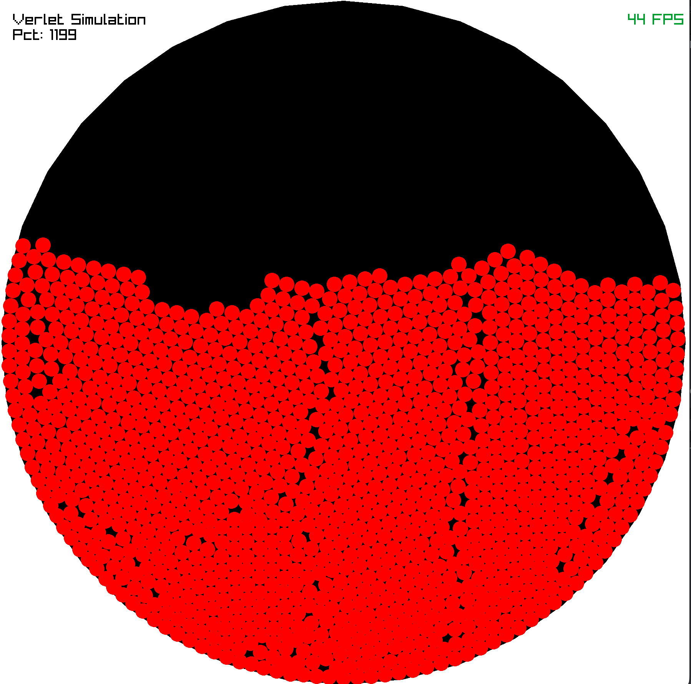
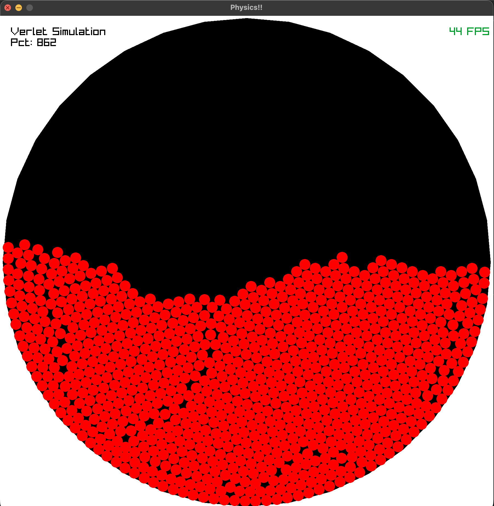
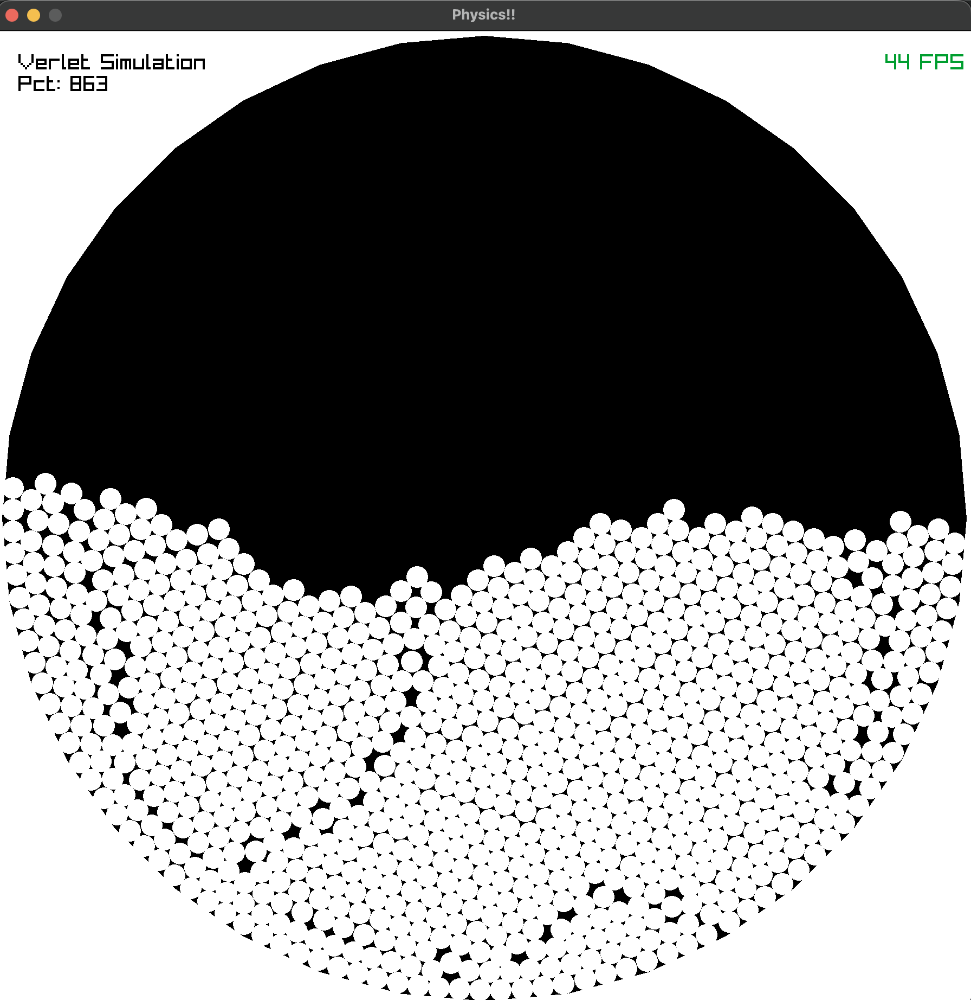

# verlet-doodles

A Verlet integration 2D physics engine written in zig... for fun.

This is a simple implementation of a verlet integration simulation written in zig. 
It is for for my own education and learning of the zig programming language and game physics.

## Sources of Inspiration

The source of inspiration for this project comes from the following video and associated videos and repository:

[Writing a Physics Engine From Scratch](https://www.youtube.com/watch?v=lS_qeBy3aQI)

## Dependencies

[Raylib Zig Bindings](https://github.com/raylib-zig/raylib-zig)

## Build and run

To build the project, make sure you have Zig installed on your system. Then, run the following command in the project directory:

```bash
zig build run
```

## TODO

- [X] Click to set emitter location
- [X] Reset button
- [X] Random size particles
- [X] Change colors over time
- [ ] Smarter collision algorithm
- [ ] Change container shape
- [X] Turn gravity on/off
- [ ] Add logging
- [ ] Add profiler [Tracy](https://www.reddit.com/r/Zig/comments/zpwoca/is_profiling_with_tracy_still_straightforward_can/)

## First steps

I want to play with performance a bit and see how I can approach the organization of this code to support a larger 
number of particles. My current termination condition is when the application can no longer maintain 75% of the target fps (45fps).

The initial implementation gets to about 1100 particles before dropping below 45fps on my machine. This is with a naive O(n^2) 
collision detection algorithm. This is also with 8 substeps per frame, which gives a nice stable simulation.



### 16 Substeps



### Detrminism

The simulation is also deterministic which is nice. Running the same simulation multiple times with the same initial conditions produces the same results.




